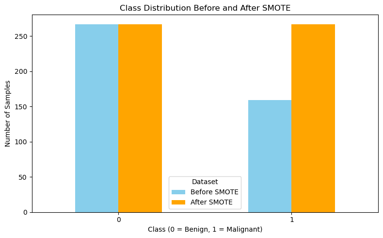

# Breast Cancer Wisconsin Dataset Analysis

This project involves an in-depth analysis of the Breast Cancer Wisconsin dataset to improve diagnostic testing for breast cancer. 
* Our work includes extensive data preprocessing, exploratory analysis, and the implementation of machine learning models, such as K-Nearest Neighbors (KNN), to classify cancer diagnoses as benign or malignant. 
* We conducted feature selection and optimization to identify the most important diagnostic features, streamlining the predictive model while maintaining high accuracy. 
* This comprehensive approach demonstrates the potential of data-driven methods to refine and enhance cancer diagnostics.

***
## Content
1. [Dataset Description](#dataset-description)
2. [Objectives](#objectives)
3. [Analytical Approach](#analytical-approach)
3. [Results](#results)
4. [Exploratory data analysis](#exploratory-data-analysis)
5. [Data preprocessing](#data-preprocessing)
6. [Team members](#team-members)

## Dataset Description

The Breast Cancer Wisconsin (Diagnostic) Dataset is derived from digitized images of fine-needle aspirate (FNA) tests performed on breast masses. These images capture microscopic views of cell nuclei, providing quantitative measurements of various characteristics that help distinguish between benign (non-cancerous) and malignant (cancerous) cases.

**Cell nuclei of benign (left) and malignant (right) breast tissue**


Image source: [Sizilio et al. 2012](https://www.researchgate.net/publication/232811011_Fuzzy_method_for_pre-diagnosis_of_breast_cancer_from_the_Fine_Needle_Aspirate_analysis)


* **Dataset Size:** 569 samples.
* **Features:** 30 numerical features extracted from digitized images such as radius, perimeter, and area.
* **Target Variable:** Diagnosis labes
    * M (Malignant): Cancerous samples.
    * B (Benign): Non-cancerous samples.
* **Source:** [UC Irvine Machine Learning Repository](https://archive.ics.uci.edu/dataset/17/breast+cancer+wisconsin+diagnostic)
    

## Objectives

The goal of this project is to:

* Build a machine learning model to classify cancer diagnoses.
* Identify critical diagnostic features to potentially reduce costs while preserving accuracy.
* Evaluate model performance through metrics such as accuracy, precision, recall, and F1-score.


## Analytical Approach

1. **Exploratory Data Analysis:**
    * Examined feature distributions and their relationships with the target variable.
    * Identified key patterns and correlations to guide feature selection.

2. **Data Preprocessing:**
    * Standardized features to ensure consistent scaling.
    * Addressed class imbalance using SMOTE to improve model performance on minority classes.
    * Split the dataset into training and test sets (75-25 split) with stratification to preserve class proportions.

3. **Model Development:**

    * KNN Exploration: Initial experiments with K-Nearest Neighbors (KNN) involved feature selection and iterative testing to optimize accuracy. However, the model struggled with performance and handling imbalanced data.
    * GBM Implementation: Transitioned to a Gradient Boosting Machine (LightGBM) model, which outperformed KNN in both accuracy and robustness. GridSearchCV was used for hyperparameter tuning, and the final model achieved:
        * Accuracy: 97%
        * ROC-AUC Score: 0.996

4. **Feature Selection:**

    * Feature importance analysis from the GBM model identified perimeter_worst, area_worst, and concave_points_mean as the most impactful features. These insights align with clinical knowledge and support cost-effective diagnostic testing.

## Results

#### Exploratory data analysis

1. **Distribution of Cancer Diagnosis**

This bar plot shows the distribution of the target variable, Diagnosis, across the dataset. Approximately 37% of the samples are labeled as malignant (M), while 63% are benign (B). This imbalance highlights the importance of building a robust classification model that performs well across both classes, especially for detecting malignant cases where early diagnosis is critical.


2. **Feature Correlation Heatmap**

The heatmap visualizes the correlation between features in the dataset. Several features, such as radius1, perimeter1, and area1, exhibit strong positive correlations with each other. These relationships suggest that some features may provide redundant information. This insight is important for feature selection, as removing highly correlated features could simplify the model without compromising accuracy. Additionally, weaker correlations with symmetry1 and fractal_dimension1 suggest these features might be less influential in classification.


3. **Distribution of Features by Diagnosis**

This faceted plot shows the distribution of the first 10 features by diagnosis (M or B). Malignant cases (M) tend to have higher values for features such as radius1, area1, and concavity1. Benign cases (B) show a tighter spread and lower average values for these features. These trends indicate that these features are highly discriminative and can aid in distinguishing between benign and malignant diagnoses.


4. **Scatter Plot of Radius vs. Area**

The scatter plot illustrates the relationship between radius1 and area1, color-coded by diagnosis. A strong positive correlation exists between these two features. Additionally, malignant samples (M) occupy a distinct range with higher values compared to benign samples (B). This separation emphasizes the importance of these features in the classification task and aligns with our objective to identify critical diagnostic features.


#### Data preprocessing

The data preprocessing steps ensured the dataset was clean, balanced, and ready for modeling::
1. **Renaming Columns**: For easier interpretation by adding suffixes (mean, se, worst).
1. **Splitting Data**: Train-test split with stratification to balance the target classes while preserving class proportions.
2. **Balancing Classes**: Using SMOTE (Synthetic Minority Oversampling Technique) to address class imbalance.

```Python
# Rename Columns
new_columns = ['ID', 'Diagnosis']
for i in range(30):
    column_name = cancer.columns[i + 2]
    suffix = 'mean' if column_name.endswith('1') else 'se' if column_name.endswith('2') else 'worst'
    new_columns.append(column_name[:-1] + '_' + suffix)
cancer.columns = new_columns

# Prepare Features and Target
X = cancer.drop(columns=['ID', 'Diagnosis'])  # Drop ID and target
y = (cancer['Diagnosis'] == 'M').astype(int)  # Binary encoding: 1 for Malignant, 0 for Benign

# Stratified Train-Test Split
X_train, X_test, y_train, y_test = train_test_split(X, y, test_size=0.25, stratify=y, random_state=42)

# Balance the Training Set Using SMOTE
smote = SMOTE(random_state=42)
X_train_balanced, y_train_balanced = smote.fit_resample(X_train, y_train)
```

**Class distribution before and after SMOTE**



#### GBM Model development and optimization

To classify breast cancer diagnoses, we implemented a Gradient Boosting Machine (GBM) model using LightGBM. This model was chosen for its ability to handle imbalanced datasets effectively, provide feature importance insights, and deliver high accuracy.

Hyperparameter Tuning
We used GridSearchCV to optimize the model's hyperparameters. The following grid was explored:

num_leaves: Controls the complexity of individual leaves in the decision tree.
min_data_in_leaf: Sets the minimum data required in each leaf.
max_depth: Limits the depth of trees to prevent overfitting.
learning_rate: Balances model convergence speed and accuracy.
n_estimators: Determines the number of boosting rounds.
The best parameters, determined through cross-validation (5 folds), resulted in a ROC-AUC score of 0.996 during training.

Model Training and Evaluation
Training:

The GBM model was trained on the balanced dataset (using SMOTE) with the best hyperparameters obtained from GridSearchCV.
Predictions:

Predictions were made on the test set, providing both class labels (y_pred) and probabilities (y_pred_proba).
Performance Metrics:

Accuracy: 97%
ROC-AUC: 0.996
High recall for malignant cases ensures minimal missed diagnoses.
Feature Importance
The GBM model identified the top 10 features contributing to predictions, which align with known clinical indicators of malignancy. 


#### GBM/KNN model development and optimization
Based on the results from applying KNN, adding any features beyond the first nine does not improve any of the provided metrics, including the accuracy score. Please find below these features:
 - area_worst
 - compactness_se
 - concavity_mean
 - perimeter_worst
 - area_se
 - compactness_worst
 - concave_points_se
 - smoothness_worst
 - area_mean.

### Discussion

### Team members

| Name       | GitHub Account                        | Email                           | Roles/Responsibilities                     | Link to Video                    |
|------------|---------------------------------------|---------------------------------|--------------------------------------------|----------------------------------|
| **Alex Feht**   | [@ALEX8642](https://github.com/ALEX8642) | [Afeht8642@gmail.com](mailto:Afeht8642@gmail.com) | Data cleanup, GBM model development and optimization   | [Demo Video](https://example.com/video1) |
| **Beth Bai**   | [@cwlh07](https://github.com/cwlh07) | [cwlh07@gmail.com](mailto:cwlh07@gmail.com)       | Exploratory data analysis, Visualization, GBM model optimization. | [Demo Video](https://example.com/video2) |
| **Himeshi Sam**| [@HimeshiS](https://github.com/HimeshiS)         | [himeshis575@gmail.com](mailto:himeshis575@gmail.com) | Exploratory data analysis, Preliminary KNN model, Documentation   | [Demo Video](https://example.com/video3) |
| **Ivan Makushenko**   | [@malkus1306](https://github.com/malkus1306) | [ivan.makushenko@gmail.com](mailto:ivan.makushenko@gmail.com) | Feature selection, KNN model optimization, Documentation | [Demo Video](https://example.com/video4) |


