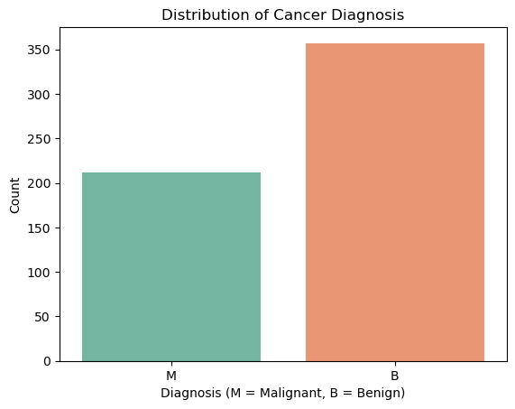
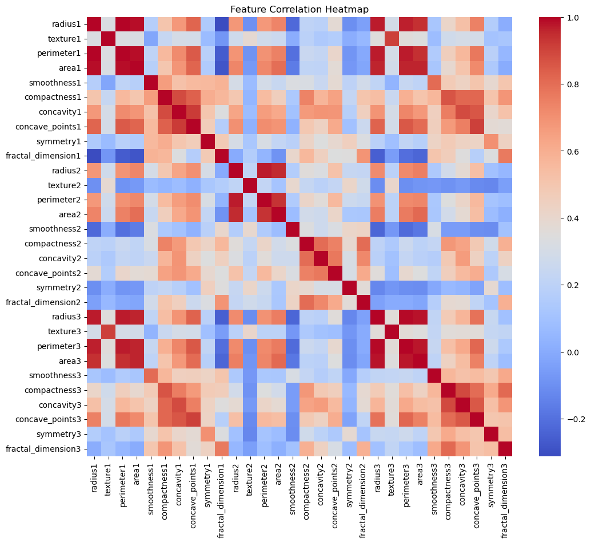
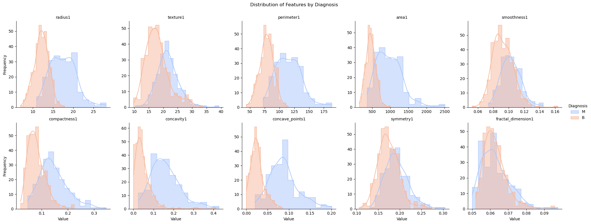
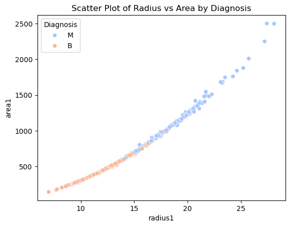

# Breast Cancer Wisconsin Dataset Analysis

This project involves an in-depth analysis of the Breast Cancer Wisconsin dataset to improve diagnostic testing for breast cancer. 
* Our work includes extensive data preprocessing, exploratory analysis, and the implementation of machine learning models, such as K-Nearest Neighbors (KNN), to classify cancer diagnoses as benign or malignant. 
* We conducted feature selection and optimization to identify the most important diagnostic features, streamlining the predictive model while maintaining high accuracy. 
* This comprehensive approach demonstrates the potential of data-driven methods to refine and enhance cancer diagnostics.

***
## Content
1. [Dataset Description](#dataset-description)
2. [Objectives](#objectives)
3. [Analytical Approach](#analytical-approach)
3. [Results](#results)
4. [Exploratory data analysis](#exploratory-data-analysis)
5. [Data preprocessing](#data-preprocessing)
6. [Team members](#team-members)

## Dataset Description

The Breast Cancer Wisconsin (Diagnostic) Dataset is derived from digitized images of fine-needle aspirate (FNA) tests performed on breast masses. These images capture microscopic views of cell nuclei, providing quantitative measurements of various characteristics that help distinguish between benign (non-cancerous) and malignant (cancerous) cases.

**Cell nuclei of benign (left) and malignant (right) breast tissue**

Image source: [Sizilio et al. 2012](https://www.researchgate.net/publication/232811011_Fuzzy_method_for_pre-diagnosis_of_breast_cancer_from_the_Fine_Needle_Aspirate_analysis)

* **Dataset Size:** 569 samples.
* **Features:** 30 numerical features extracted from digitized images such as radius, perimeter, and area.
* **Target Variable:** Diagnosis labes
    * M (Malignant): Cancerous samples.
    * B (Benign): Non-cancerous samples.
* **Source:** [UC Irvine Machine Learning Repository](https://archive.ics.uci.edu/dataset/17/breast+cancer+wisconsin+diagnostic)
    

## Objectives

The goal of this project is to:

* Build a machine learning model to classify cancer diagnoses.
* Identify critical diagnostic features to potentially reduce costs while preserving accuracy.
* Evaluate model performance through metrics such as accuracy, precision, recall, and F1-score.

## Analytical Approach

We think that our problem is a classification problem. We are using KNN method to propose a solution.
More specifically we suggest the following steps:

 - Standardize the dataset for the features.
 - Split the dataset into training and test sets with a 75-25 split.
 - Calculate the Chi-square score for each feature to understand its statistical significance relative to the target variable (Diagnosis).
 - Apply Forward Feature Selection to determine the most important features.
 - The general idea is to iteratively add features based on the performance of the KNN method, optimizing for accuracy.
 - Step 1: Run KNN independently for each feature to determine which single feature yields the highest accuracy score. This feature will be selected as feature1.
 - Step 2: Run KNN independently for feature1 combined with each other feature to determine which combination yields the highest accuracy score. The next feature selected in this step will be feature2.
 - Continue iteratively adding features in this way, up to a maximum of 15 features, aiming to reduce the initial 30 features by at least half to meet our business requirements.
 - Based on the results of these iterations, we will identify any features where adding them does not improve the performance metrics, including accuracy.

## Results

#### Exploratory data analysis

1. **Distribution of Cancer Diagnosis**

This bar plot shows the distribution of the target variable, Diagnosis, across the dataset. Approximately 37% of the samples are labeled as malignant (M), while 63% are benign (B). This imbalance highlights the importance of building a robust classification model that performs well across both classes, especially for detecting malignant cases where early diagnosis is critical.

2. **Feature Correlation Heatmap**

The heatmap visualizes the correlation between features in the dataset. Several features, such as radius1, perimeter1, and area1, exhibit strong positive correlations with each other. These relationships suggest that some features may provide redundant information. This insight is important for feature selection, as removing highly correlated features could simplify the model without compromising accuracy. Additionally, weaker correlations with symmetry1 and fractal_dimension1 suggest these features might be less influential in classification.

3. **Distribution of Features by Diagnosis**

This faceted plot shows the distribution of the first 10 features by diagnosis (M or B). Malignant cases (M) tend to have higher values for features such as radius1, area1, and concavity1. Benign cases (B) show a tighter spread and lower average values for these features. These trends indicate that these features are highly discriminative and can aid in distinguishing between benign and malignant diagnoses.

4. **Scatter Plot of Radius vs. Area**

The scatter plot illustrates the relationship between radius1 and area1, color-coded by diagnosis. A strong positive correlation exists between these two features. Additionally, malignant samples (M) occupy a distinct range with higher values compared to benign samples (B). This separation emphasizes the importance of these features in the classification task and aligns with our objective to identify critical diagnostic features.

#### Data preprocessing

#### GBM/KNN model development and optimization
Based on the results from applying KNN, adding any features beyond the first nine does not improve any of the provided metrics, including the accuracy score. Please find below these features:
 - area_worst
 - compactness_se
 - concavity_mean
 - perimeter_worst
 - area_se
 - compactness_worst
 - concave_points_se
 - smoothness_worst
 - area_mean.

### Discussion

### Team members

| Name       | GitHub Account                        | Email                           | Roles/Responsibilities                     | Link to Video                    |
|------------|---------------------------------------|---------------------------------|--------------------------------------------|----------------------------------|
| **Alex Feht**   | [@ALEX8642](https://github.com/ALEX8642) | [Afeht8642@gmail.com](mailto:Afeht8642@gmail.com) | Data cleanup, GBM model development and optimization   | [Demo Video](https://example.com/video1) |
| **Beth Bai**   | [@cwlh07](https://github.com/cwlh07) | [cwlh07@gmail.com](mailto:cwlh07@gmail.com)       | Exploratory data analysis, Visualization, GBM model optimization. | [Demo Video](https://example.com/video2) |
| **Himeshi Sam**| [@HimeshiS](https://github.com/HimeshiS)         | [himeshis575@gmail.com](mailto:himeshis575@gmail.com) | Exploratory data analysis, Preliminary KNN model, Documentation   | [Demo Video](https://example.com/video3) |
| **Ivan Makushenko**   | [@malkus1306](https://github.com/malkus1306) | [ivan.makushenko@gmail.com](mailto:ivan.makushenko@gmail.com) | Feature selection, KNN model optimization, Documentation | [Demo Video](https://example.com/video4) |

